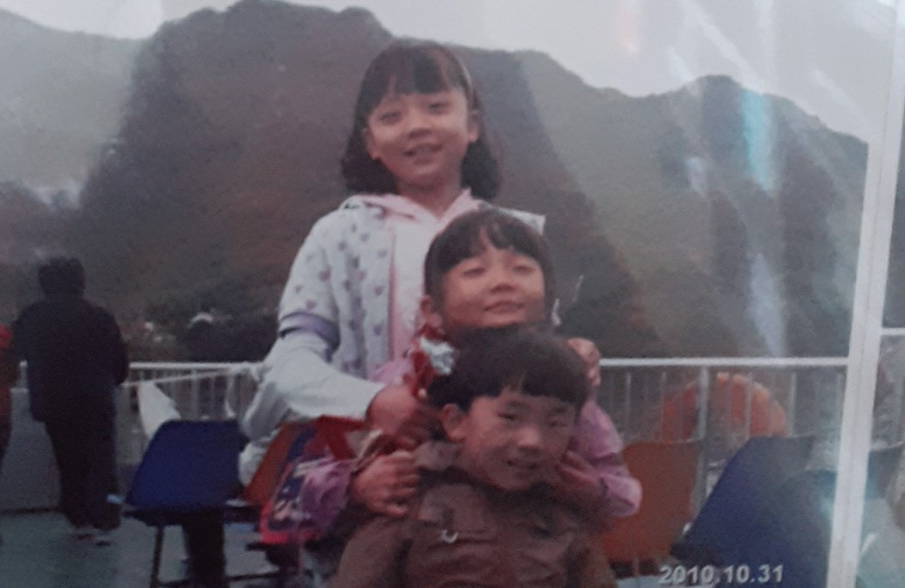

<!doctype html>
<html>
<head>
  <title>Seoul tasty road</title>
  <meta charset="utf-8">
</head>
<body>
  <h1><a href="Seoul tasty road.html">Seoul tasty road</a></h1>
  <ul>
    <li><a href="Line 2.html">Line 2</a></li>
  </ul>
  <h2>The reason that i made this website</h2>
  
  
우리 삼남매는 <strong><u>유전적으로</u> 머리가 좋기 때문에</strong> 셋 다 서울에서 대학을 다닐 것이 분명하고 그렇게 되면 적어도 4년은 서울에서 살게 되는 것인데 밥을 어디서 먹을 것인지 결정해야 할 때마다 인터넷을 검색하거나 친구들한테 물어보는 행위는 생각보다 많은 시간을 소모한다. 티끌모아 태산이므로 위 행위에 소모되는 시간을 모아 휴식을 취하거나 자기개발을 하게 된다면 앞으로 우리 가족의 미래가 밝을 것이다. 즉 서울 맛지도 사이트는 <strong>우리 가족의 밝은 앞날을 위한 주춧돌</strong>인 것이다.

<!--Start of Tawk.to Script-->

<!--End of Tawk.to Script-->
</body>
</html>

